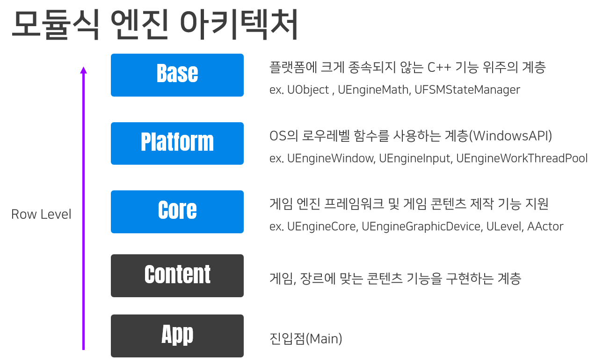
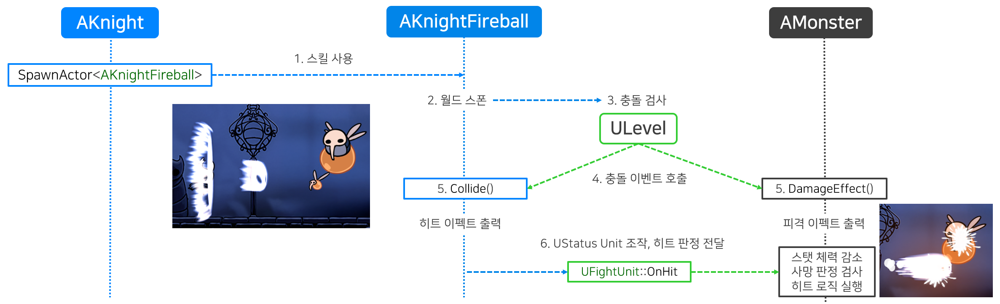
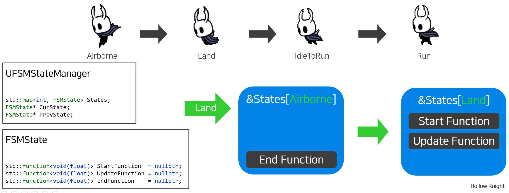
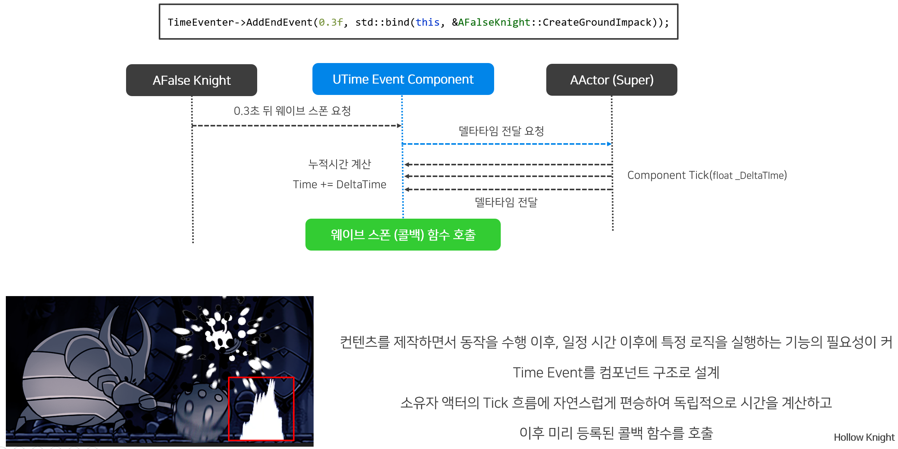
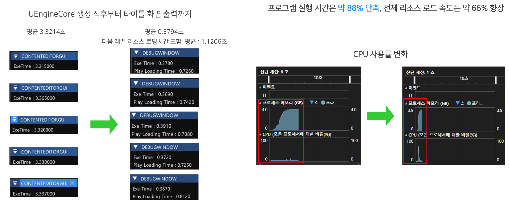
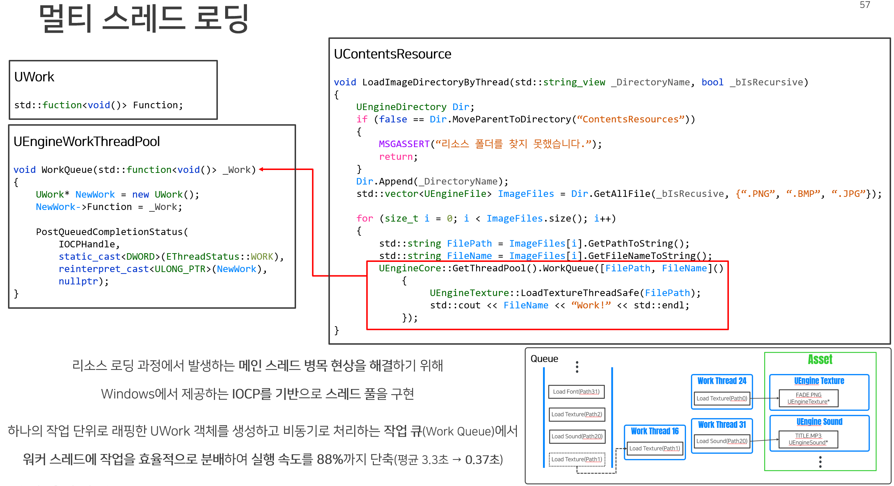

# 할로우 나이트(Hollow Knight) 모작 프로젝트 소개 및 시연

## 플레이 영상
<p align="center">
 
</p>

영상 링크 : https://youtu.be/vi6KnUeedrs?si=0_Tf7Nd8dymysKVo
<br>

## 기술스택
* 언어 : C++ 20
* API : DirectX11, WindowsAPI
* 라이브러리 : DirectXTex, FOMD, ImGui, FW1FontWrapper
* 개발환경 : Visual Studio 2022
* 형상관리 : Git
<p>

## 작업
### 게임 엔진 프레임워크

<p align="center">
 
</p>

<p>
<details>
<summary> 자세히 보기 (클릭) </summary><p>


1. Base 계층 (C++)
* UObject : 객체 이름 설정, Tick 및 렌더링 활성화 여부, 디스트로이 트리거, 특정 객체 디버깅 타겟 설정
* UEngineTimer : 델타 타임 계산
* UEngineRandom : 메르센 트위스터 기반 랜덤 기능 지원
* UEnginePath / UEngineFile / UEngineDirectory : std::filesystem 기반 함수 지원
* UEngineMath : 물리 기반 함수 지원
* EngineSerializer : 직렬화/역직렬화 기능 지원
* FSMStateManager : 상태 기반 콜백 함수 호출 기능 지원
<p>

2. Platform 계층 (Windows API)
* EngineWindow : 윈도우 창 생성 및 윈도우 메시지 루프
* EngineInput : 키보드 입력 관련 기능 지원
* EngineSound : FMOD 라이브러리 래핑 객체, 사운드 관련 기능 지원
* EngineWinImage : bmp 파일 관련 이미지 기능 지원
* EngineWorkThreadPool : IOCP 기반 스레드 풀 기능 지원
<p>

3. Engine Core 계층 (게임 엔진 프레임워크)
* EngineCore : 모든 계층의 기능을 총괄하고 게임의 메인 루프를 구동하는 관리자
* Level : 게임의 월드, 액터를 관리하고 최종 렌더 타겟을 백버퍼로 전송하여 화면에 출력
* Actor : 레벨에 생성 가능한 객체, 컴포넌트 관리 주체
* UActorComponent : 컴포넌트 기반 클래스. 액터에 종속되어 생명주기를 따라감
* USceneComponent : 크기, 위치, 회전(Transform)을 부여하는 클래스, 씬 컴포넌트를 상속한 클래스는 서로 부착(Attach)하여 종속 관계 설정 가능
* GameMode : 게임의 규칙을 정의
* HUD : 위젯의 관리 주체
* EngineGrapicDevice : 렌더링 파이프라인 설정 주체
* RenderUnit : 렌더링에 필요한 모든 데이터의 최소 단위
* Renderer : USceneComponent로 액터에 부착하여 렌더링하는 기능을 생산할 수 있는 주체
* ACameraActor : 독립된 시점을 가지며 렌더러를 관리하는 주체
* EngineResourceBase : 모든 리소스를 저장하고 관리하며 재사용할 수 있는 기능을 지원
* EngineGUI : ImGui를 래핑한 객체
<p>

4. 컨텐츠 계층
* 게임 프로젝트 구현 계층
<p>

5. App 계층
* 진입점(main)

</details><p>

### 컨텐츠
- 플레이어 (나이트)
- 플레이어 스킬 4종 (공격, 대시, 파이어볼, 집중)
- 몬스터 9종 (보스 : 실패한 기사)
- 맵 (흙의 마을 ~ 잊혀진 교차로 일부)
- 이펙트
- UI
- 타이틀 화면


### 실행방법
<details>
<summary> 자세히 보기 (클릭) </summary><p>
  1. "App" 프로젝트 우클릭, 시작 프로젝트로 설정합니다. </p>
   </p>
   </p>
2. 프로젝트 구성을 "Release"로 설정합니다. </p>
 </p>
3. 실행(F5)합니다.

</details>

### 조작
<p>
<details>
<summary> 자세히 보기 (클릭) </summary><p>

#### 타이틀
- 플레이 시작 : Space Bar (게임 타이틀 등장 이후 동작)


#### 플레이
- 이동 :  →, ←, ↑, ↓
- 점프 : Z (누르는 시간에 따라 점프 높이 조절)
- 대시 : C
- 공격 : X
- 파이어볼 : A 
- 집중 : A (Press)


#### 치트키
<details> 
- Hp + 1 : B</p>
- Hp - 1 : V</p>
- Mp Max : S</p>
- 다시 시작 : F4</p>
- 프리 카메라 : F8</p>
- 프리 카메라 이동 : W, A, S, D</p>
- 프리 카메라 회전 : 마우스 우클릭 누른 상태로 이동 버튼 입력</p>
</details>
</details></p>

___

## 주요 기능 상세 구현
1. ```UEngineCore```
2. ```ULevel```
3. ```AActor```
4. ```Component```
5. ```USpirteRenderer```
6. 픽셀 충돌
7. ```UCollision```
8. ```ASkill```
9. ```UFSMStateManager```
10. ```UTimeEventComponent```
11. 몬스터 인공지능
12. 멀티 스레드 로딩 및 리소스 관리

___

## 1. 엔진 아키텍처  

</p>

엔진의 주요 실행 흐름은 다음과 같습니다. 
1. ```Main```에서 ```UEngineCore::StartEngine```을 호출하며 엔진을 시작합니다.
2. ```GEngine``` 전역 인스턴스를 중심으로 윈도우, 스레드 풀, 렌더링 파이프라인 등 핵심 기능을 초기화합니다.
3. ```UEngineWindow::WindowsMessgaeLoop```안에서 매 프레임 ```UEngineCore::EngineFrame``` 게임 루프를 호출합니다.
4. 게임 루프는 ```ULevel```을 통해 월드 내 모든 객체의 ```Tick```, ```Render```, ```Collision```, ```Release``` 로직을 순차적으로 처리하며 레벨의 전환을 관리합니다.

#### ```UEngineCore``` : 심장
엔진의 생명 주기를 관리하는 싱글톤 객체입니다. 초기화, 게임 루프, 레벨 관리, 전역 기능 제공, 자원 해제 등 엔진의 핵심 역할을 담당합니다. <br>

<p>
<details>
<summary> 구현 코드: 게임 엔진 초기 설정 및 게임 루프 (클릭) </summary><p>

#### ```StartEngine``` : 초기 설정
```Main```으로부터 호출되는 전역 함수로 엔진의 핵심 객체(```GEngine```)를 스택에 생성하여 프로그램 생명 주기와 동일하게 관리합니다. <br>
윈도우 생성, 콘텐츠 로드, 렌더링 파이프라인 설정 등 프레임이 돌기 전 모든 초기 설정을 담당합니다.

```cpp
// UEngineCore.h
	ENGINEAPI static void StartEngine(HINSTANCE _Instance, std::string_view _DllName);

// UEngineCore.cpp
void UEngineCore::StartEngine(HINSTANCE _Instance, std::string_view _DllName)
{
	UEngineDebug::CheckMemoryLeak();

	UEngineCore EngineCore;

	GEngine = &EngineCore;

	GEngine->ThreadPool.Initialize();

	CreateAndShowWindow(_Instance);

	LoadContents(_DllName);

	UEngineWindow::WindowMessageLoop(
		[]()
		{
#ifdef _DEBUG
			UEngineDebug::StartConsole();
#endif
			UEngineSound::Init();

			GEngine->Device.SetupRenderingPipeline();

			GEngine->Core->StartEngine(GEngine->Data);
			
			GEngine->MainWindow.SetWindowPosAndScale(GEngine->Data.WindowPos, GEngine->Data.WindowSize);

			GEngine->Device.CreateBackBuffer(GEngine->MainWindow);

			UEngineGUI::Init();
		},
		[]()
		{
			EngineFrame();
		},
		[]()
		{
			EndEngine();
		});	
}
```
<br>

#### ```EngineFrame``` : 게임 루프
* 매 프레임 호출되는 엔진의 심장입니다. 레벨 전환 로직을 우선 처리한 후, 델타 타임 계산, 입력 및 사운드 갱신, 현재 레벨의 Tick, Render 등의 함수를 순차적으로 호출합니다.

```cpp
void UEngineCore::EngineFrame()
{
	// 레벨 전환은 해당 프레임이 실행 중에 전환되지 않고 다음 프레임에서 전환
	if (true == GEngine->IsCurLevelReset)
	{
		GEngine->CurLevel = nullptr;
		GEngine->IsCurLevelReset = false;
	}

	if (nullptr != GEngine->NextLevel) 
	{
		if (nullptr != GEngine->CurLevel) 
		{
			GEngine->CurLevel->EndLevel();
		}

		GEngine->CurLevel = GEngine->NextLevel; 

		GEngine->CurLevel->StartLevel(); 
		GEngine->NextLevel = nullptr;
		GEngine->Timer.TimeStart(); 
	}

	GEngine->Timer.TimeCheck(); 
	float DeltaTime = GEngine->Timer.GetDeltaTime();

	if (true == GEngine->MainWindow.IsFocus()) 
	{
		UEngineInput::CheckInput(DeltaTime);
	}
	else 
	{
		UEngineInput::ResetKey();
	}

	UEngineSound::Update();

	// 레벨에서 틱, 렌더, 충돌, 삭제를 처리
	GEngine->CurLevel->Tick(DeltaTime);
	GEngine->CurLevel->Render(DeltaTime);
	GEngine->CurLevel->Collision(DeltaTime);
	GEngine->CurLevel->Release(DeltaTime);
}
```

</details>

___

#### ```ULevel``` : 게임의 무대
게임에 등장하는 모든 오브젝트, 카메라, 충돌 시스템 등 게임 세상에 존재하는 모든 요소를 총괄하고 관리하는 클래스입니다. 언리얼 엔진의 ```UWorld```와 유사한 개념으로, 모든 게임플레이 로직이 시작되는 무대입니다. <br>

* ```ULevel```은 크게 네가지 핵심적인 역할을 수행합니다.
1. 액터의 생명 주기 관리 : 레벨에 액터를 생성(```SpawnActor```)하고 매 프레임 ```Tick```을 호출하며, 레벨이 종료될 때 액터를 소멸시키는 등 모든 액터의 생명 주기를 관리합니다.
2. 최종 렌더링 : 레벨에 존재하는 여러 카메라의 렌더링 결과를 하나로 합쳐 최종적으로 화면에 그려주는 역할을 합니다.
3. 충돌 시스템 관리 : 어떤 충돌체끼리 충돌 검사를 수행할지 정의하는 콜리전 프로필을 만들고 매 프레임 ```Collision```함수를 통해 충돌 검사를 수행합니다.
4. 게임 플레이 프레임워크 제공 : 게임의 규칙을 제공하는 ```AGameMode```, 플레이어가 조작하는 ```APawn```, UI를 관리하는 ```AHUD``` 등 핵심 게임플레이 객체들을 소유하고 접근할 수 있는 기능을 제공합니다.

<p>
<details>
<summary> 구현 코드: ULevel (클릭) </summary><p>

#### ```SpawnActor``` : 액터 생성
이 코드는 레벨에 액터를 동적으로 생성하는 과정을 보여줍니다. template을 사용하여 ```AActor```를 상속한 어떠한 파생 클래스든 생성할 수 있으며 생성된 액터는 BeginPlayList라는 임시 리스트에 먼저 추가됩니다. <br>
BeginPlayList에 포함된 액터는 ```BeginPlay```가 딱 한번만 호출되도록 보장합니다. 이후 ```AllActor```에 포함되며 레벨이 액터의 생명 주기를 관리합니다.

```cpp
	template<typename ActorType>
	std::shared_ptr<ActorType> SpawnActor(std::string_view _Name = "")
	{
		static_assert(std::is_base_of_v<AActor, ActorType>, "[타입에러] 액터를 상속한 대상만 Spawn할 수 있습니다.");

		if (false == std::is_base_of_v<AActor, ActorType>)
		{
			MSGASSERT("[타입에러] 액터를 상속한 대상만 Spawn할 수 있습니다.");
			return nullptr;
		}
		
		// 생성자에서도 GetWorld()를 사용할 수 있도록 메모리 풀을 사용하여 생성
		char* ActorMemory = new char[sizeof(ActorType)];

		AActor* ActorPtr = reinterpret_cast<ActorType*>(ActorMemory);
		ActorPtr->World = this; // GetWorld() != nullptr가 되는 순간

		ActorType* NewPtr = reinterpret_cast<ActorType*>(ActorMemory);

		std::shared_ptr<ActorType> NewActor(NewPtr = new(ActorMemory) ActorType());

		ActorPtr->SetName(_Name);

		BeginPlayList.push_back(NewActor);

		return NewActor;
	}
```
<br>

#### ```Tick``` : 액터 로직 실행

```cpp
void ULevel::Tick(float _DeltaTime)
{
    ...

	// 1. 해당 프레임에 생성된 Actor의 BeginPlay를 먼저 호출한다.
	std::list<std::shared_ptr<class AActor>>::iterator StartIter = BeginPlayList.begin();
	std::list<std::shared_ptr<class AActor>>::iterator EndIter = BeginPlayList.end();
	for (; StartIter != EndIter; )
	{
		std::shared_ptr<AActor> CurActor = *StartIter;

		if (false == CurActor->IsActive()) // 비활성화된 액터는 일단 생략
		{
			++StartIter;
			continue;
		}

		StartIter = BeginPlayList.erase(StartIter); // BeginPlay가 호출된 액터는 해당 리스트에서 제거
		CurActor->BeginPlay(); 

		if (nullptr != CurActor->Parent)
		{
			continue;
		}

		AllActors.push_back(CurActor); // BeginPlay가 호출된 Actor만 Tick이 도는 ActorList에 편입
	}

	// 2. Tick 호출
	for (std::shared_ptr<AActor> CurActor : AllActors)
	{
		if (false == CurActor->IsActive()) 
		{
			continue;
		}

		CurActor->Tick(_DeltaTime);
	}
}
```

#### ```Render``` : 최종 화면 렌더링


<br>

레벨의 모든 카메라가 본 장면들을 하나로 합쳐 최종적으로 플레이어의 화면에 출력하는 과정을 보여줍니다.
플레이어의 위치와 관계 없이 항상 화면에 표시되어야 할 UI는 카메라를 따로 렌더링합니다.

```cpp
void ULevel::Render(float _DeltaTime)
{
	UEngineCore::GetDevice().StartRender(); // 백버퍼 초기화 및 OM단계에서 사용할 RTV와 DSV 설정

	LastRenderTarget->ClearRenderTargets();

	for (std::pair<const int, std::shared_ptr<ACameraActor>>& Camera : AllCameras)
	{
		if (Camera.first == static_cast<int>(EEngineCameraType::UICamera)) 	// UI카메라는 따로 렌더를 돌려준다.
		{
			continue;
		}

		if (false == Camera.second->IsActive())
		{
			continue;
		}

		Camera.second->Tick(_DeltaTime); // View 행렬과 Projection 행렬 계산
		Camera.second->GetCameraComponent()->Render(_DeltaTime);
		Camera.second->GetCameraComponent()->CameraTarget->MergeToRenderTarget(LastRenderTarget);
	}

	if (true == AllCameras.contains(static_cast<int>(EEngineCameraType::UICamera)))
	{
		std::shared_ptr<ACameraActor> CameraActor = AllCameras[static_cast<int>(EEngineCameraType::UICamera)];
		if (true == CameraActor->IsActive()) 
		{
			std::shared_ptr<UEngineCamera> CameraComponent = AllCameras[static_cast<int>(EEngineCameraType::UICamera)]->GetCameraComponent();

			CameraActor->Tick(_DeltaTime); 
			CameraComponent->CameraTarget->ClearRenderTargets();
			CameraComponent->CameraTarget->OMSetRenderTargets();

			HUD->UIRender(CameraComponent.get(), _DeltaTime); // UI Tick, Render
			CameraComponent->CameraTarget->MergeToRenderTarget(LastRenderTarget); 
		}
	}
	else
	{
		MSGASSERT("UI카메라가 존재하지 않습니다. UI카메라를 생성해 주세요.");
		return;
	}

	// 백버퍼 렌더 타겟 출력 병합
	std::shared_ptr<UEngineRenderTarget> BackBuffer = UEngineCore::GetDevice().GetBackBufferTarget();
	LastRenderTarget->MergeToRenderTarget(BackBuffer);

	... // (디버그 렌더링, ImGui 렌더링)

	UEngineCore::GetDevice().EndRender(); // Present
}
```
<br>
</details>

___

#### ```AActor``` : 컴포넌트를 조합하여 완성하는 무대 위의 배우
```ULevel```이 무대라면, ```AActor```는 무대 위에서 연기할 수 있는 배우입니다. 하지만 액터는 텅 빈 껍데기와 같아서, 액터 스스로는 화면에 렌더링할 수도, 크기와 위치를 가질 수도 없습니다. 다양한 컴포넌트를 조합해야 비로소 완전한 기능을 갖춘 하나의 오브젝트가 됩니다.

* ```AActor```는 크게 두 가지 핵심적인 역할을 수행합니다.
1. 컴포넌트 컨테이너 : 액터는 다양한 기능을 가진 컴포넌트들을 담는 역할을 합니다. 예를 들어, 화면에 보이려면 ```URenderer```라는 ```USceneComponenet```를, 물리적인 형태를 가지려면 ```UCollision```를 가져야 합니다. 이를 통해 상속의 한계를 벗어나 유연하고 확장성 높은 객체를 만들 수 있습니다.
2. 트랜스폼 : 액터는 ```std::shared_ptr<USceneComponent> RootComponent```를 통해 크기, 회전, 위치 값을 가질 수 있습니다. 이 정보를 통해 액터는 게임 세상 어디에, 어떤 형태로 존재하는지 표현할 수 있습니다.

<p>
<details>
<summary> 구현 코드: AActor (클릭) </summary><p>

#### ```CreateDefaultSubobject``` : 컴포넌트 생성
액터의 핵심 기능인 컴포넌트를 생성하는 함수입니다. 컴포넌트를 액터의 관리 대상에 포함시켜 액터가 컴포넌트의 생명 주기를 관리하는 주체가 됩니다.

```cpp
	template<typename ComponentType>
	inline std::shared_ptr<ComponentType> CreateDefaultSubobject()
	{
		static_assert(std::is_base_of_v<UActorComponent, ComponentType>, "액터 컴포넌트를 상속한 대상만 CreateDefaultSubObject<>()할 수 있습니다.");

		if (false == std::is_base_of_v<UActorComponent, ComponentType>)
		{
			MSGASSERT("액터 컴포넌트를 상속한 대상만 CreateDefaultSubObject<>()할 수 있습니다.");
			return nullptr;
		}

		size_t Size = sizeof(ComponentType);
		char* CompMemory = new char[sizeof(ComponentType)];

		UActorComponent* CompPtr = reinterpret_cast<ComponentType*>(CompMemory);
		CompPtr->Actor = this;

		ComponentType* NewPtr = reinterpret_cast<ComponentType*>(CompMemory);

		std::shared_ptr<ComponentType> NewComp(new(CompMemory) ComponentType());

		AllComponentList.push_back(NewComp);

		if (std::is_base_of_v<UActorComponent, ComponentType> 
			&& !std::is_base_of_v<USceneComponent, ComponentType>)
		{
			AllActorComponents.push_back(NewComp);
		}
		else if(!std::is_base_of_v<UActorComponent, ComponentType>
			&& !std::is_base_of_v<USceneComponent, ComponentType>)
		{
			MSGASSERT("액터 컴포넌트를 상속한 대상만 CreateDefaultSubObject<>()할 수 있습니다.");
		}

		return NewComp;
	}
```
<br>

#### ```Tick``` : 컴포넌트 로직 실행
액터의 ```Tick```함수는 매 프레임마다 자신에게 부착된 모든 자식 액터와 컴포넌트들의 ```Tick```함수를 순차적으로 호출해주는 역할을 수행합니다.
따라서 자식 클래스는 반드시 ```AActor::Tick```을 명시해야 합니다.
```cpp
void AActor::Tick(float _DeltaTime)
{
	for (std::shared_ptr<AActor>& Actor : ChildList)
	{
		Actor->Tick(_DeltaTime);
	}

	if (nullptr == Parent)
	{
		if (nullptr != RootComponent)
		{
			RootComponent->ComponentTick(_DeltaTime);
		}
	}
	for (std::shared_ptr<class UActorComponent> ActorComponent : AllActorComponents)
	{
		if (false == ActorComponent->IsActive())
		{
			continue;
		}

		ActorComponent->ComponentTick(_DeltaTime);
	}
}
```
<br>
</details>

___

#### ```Component``` : 기능 단위
컴포넌트는 역할에 따라 **'논리적 기능'**과 **'물리적 실체'**를 담당하는 두 종류로 나뉩니다. 이는 모든 기능이 위치 정보를 가질 필요는 없다는 설계 철학에 기반하며, 각각 ```UActorComponent```와 ```USceneComponent```가 그 역할을 담당합니다.

#### ```UActorComponent``` : 논리적 기능
모든 컴포넌트가 월드에 물리적인 형태로 존재할 필요는 없습니다. 예를 들어, 플레이어의 스탯, 인벤토리 데이터, AI의 판단 로직 등은 눈에 보이지 않는 순수한 기능입니다. 이처럼 트랜스폼(Transform) 없이 동작이나 데이터만을 제공하는 컴포넌트는 ```UActorComponent```를 상속받아 구현합니다.

#### ```USceneComponent``` : 실체적 기능
반대로 스프라이트, 3D 모델, 충돌체, 이펙트처럼 월드에 물리적인 실체로 존재해야 하는 대상은 USceneComponent를 상속받아 구현합니다. <br>
USceneComponent가 UActorComponent와 구별되는 가장 큰 특징은 Transform을 가지며, 컴포넌트 간에 부모-자식 관계의 계층 구조를 형성할 수 있다는 점입니다. Attach 기능을 통해 한 컴포넌트를 다른 컴포넌트에 부착할 수 있으며, 이를 통해 복잡한 오브젝트를 쉽게 조립할 수 있습니다. <br>

계층 구조의 원리: 부모의 트랜스폼(위치, 회전, 크기)이 변경되면 자식에게 그대로 영향을 미치지만, 자식의 트랜스폼 변경은 부모에게 영향을 주지 않습니다.
* 몸통 (부모)
* 팔 (자식)
* 손가락 (자손)

위 구조에서 '몸통'이 움직이면 '팔'과 '손가락'이 모두 따라 움직이지만, '팔'만 움직인다고 해서 '몸통'이 움직이지는 않습니다. 이를 통해 캐릭터의 관절처럼 유기적인 움직임을 손쉽게 구현할 수 있습니다.

```cpp
class USceneComponent : public UActorComponent, public UTransformObject

void UTransformObject::SetupAttachment(UTransformObject* _Parent)
{
	Parent = _Parent;
	Parent->Childs.push_back(this);

	TransformUpdate();
}
```
<br>

## 2. 컨텐츠  
#### ```USpriteRenderer``` : 2D 그래픽과 애니메이션의 핵심
```USpriteRenderer```는 2D 이미지를 화면에 그리고 여러 이미지를 연속으로 재생하여 애니메이션을 구현하는 **2D 렌더링의 핵심 컴포넌트**입니다. ```USceneComponent```를 상속받아 월드에 배치될 수 있는 물리적 실체를 가지며 ```AActor```에 부착되어 해당 액터의 시각적 모습을 담당합니다.

* 주요 기능
1. 자동 스케일링 : 이미지의 원본 크기에 맞춰 액터의 크기를 자동으로 조절하는 기능을 제공합니다.
2. UV 조작 및 색상 변조 : 셰이더와 연동하여 UV좌표를 변경하여 특정 부분만 잘라 사용하거나, 색상을 곱하거나 더하여 시각 효과를 보정할 수 있는 기능을 제공합니다.
3. 프레임 에니메이션 시스템 : 디렉토리에 존재하는 파일명 기반으로 텍스처를 조회하며, 프레임 범위와 재생 시간을 지정하여 이름을 Key값으로 애니메이션 을 생성합니다. 애니메이션은 ```ChangeAnimation(이름)```을 통해 간편하게 전환할 수 있습니다.


<p>
<details>
<summary> 구현 코드: USpriteRenderer (클릭) </summary><p>

#### ```CreateAnimation``` : 애니메이션 생성
스프라이트를 그룹지어 하나의 애니메이션으로 생성하는 기능을 제공합니다. 함수 오버로딩으로 매개변수를 달리하여 애니메이션 생성에 필요한 다양한 방식을 제공합니다. (ex. 벡터 값을 하나하나 입력할 필요가 없도록 범위를 지정하는 기능, 모든 스프라이트가 동일한 속도로 재생한다면 Frame을 vector<float>이 아닌 float으로 인자를 받는 등)
```cpp
void USpriteRenderer::CreateAnimation(std::string_view _AnimationName, std::string_view _SpriteName, 
std::vector<int> _Indices, std::vector<float> _Frame, bool _Loop /*= true*/)
{
	std::string UpperName = UEngineString::ToUpper(_AnimationName);

	if (_Frame.size() != _Indices.size())
	{
		MSGASSERT(UpperName + "의 스프라이트와 프레임 개수가 일치하지 않습니다.");
		return;
	}

	if (FrameAnimations.contains(UpperName))
	{
		return;
	}

	std::shared_ptr<UEngineSprite> FindSprite = UEngineSprite::Find<UEngineSprite>(_SpriteName);

	if (nullptr == FindSprite)
	{
		MSGASSERT("로드하지 않은 스프라이트가 존재합니다." + std::string(UpperName));
		return;
	}

	FrameAnimation NewAnimation;
	NewAnimation.Sprite = FindSprite.get();
	NewAnimation.FrameIndex = _Indices;
	NewAnimation.FrameTime = _Frame;
	NewAnimation.Loop = _Loop;
	NewAnimation.Reset(); // 애니메이션 재생 시 0번 인덱스부터 시작할 수 있도록 설정

	FrameAnimations.insert({ UpperName ,NewAnimation });
}
```
<br>

#### ```ChangeAnimation``` : 애니메이션 재생
호출 즉시 해당 애니메이션을 재생시키는 기능을 제공합니다.

```cpp
void USpriteRenderer::ChangeAnimation(std::string_view _AnimationName, bool _Force /*= false*/)
{
	std::string UpperName = UEngineString::ToUpper(_AnimationName);

	if (false == FrameAnimations.contains(UpperName))
	{
		MSGASSERT("등록되지 않은 애니메이션 이름입니다. : " + UpperName);
		return;
	}

	FrameAnimation* ChangeAnimation = &FrameAnimations[UpperName];

	if (CurAnimation == ChangeAnimation && false == _Force)
	{
		return;
	}

	CurAnimation = &FrameAnimations[UpperName];
	CurAnimation->Reset();
	CurIndex = CurAnimation->FrameIndex[CurAnimation->CurIndex];

	if (CurAnimation->Events.contains(CurAnimation->CurIndex))
	{
		CurAnimation->Events[CurAnimation->CurIndex]();
	}

	if (true == IsAutoScale)
	{
		FVector Scale = CurAnimation->Sprite->GetSpriteScaleToReal(CurIndex);
		Scale.Z = 1.0f;
		SetRelativeScale3D(Scale * AutoScaleRatio);
	}
}
```
<br>

텍스처의 크기는 ```ID3D11Texture2D::GetDesc``` 함수를 통해 값을 저장합니다.

```cpp
void UEngineTexture::CreateRenderTargetView(Microsoft::WRL::ComPtr<ID3D11Texture2D> _Texture2D)
{
	Texture2D = _Texture2D;
	
	// 텍스처 크기 가져오기
	Texture2D->GetDesc(&Desc);
	Size.X = static_cast<float>(Desc.Width);
	Size.Y = static_cast<float>(Desc.Height);

	CreateRenderTargetView();
}
```
<br>
</details>

___

#### 픽셀 충돌 : 엔진 계층 문제를 우회한 좌표계 변환
맵과 캐릭터 간 충돌은 픽셀 단위로 정밀하게 검사하는 픽셀 충돌 방식을 사용했습니다. 이 과정에서 화면에 보이는 배경(png)과 실제 충돌 판정에 사용되는 데이터(bmp) 간의 동기화 문제를 해결하는 것이 핵심 과제였습니다.

<p align="center">
 
</p>


#### 문제 : 데카르트 좌표계 vs 스크린 좌표계
엔진의 계층 구조상, 화면 렌더링(png)은 EngineCore 계층의 Transform을 기준으로 데카르트 좌표계로 처리되는 반면, 픽셀 데이터(bmp)는 Platform 계층에서 WindowsAPI로 관리되고 있습니다. 
만약 Platform 계층에 존재하는 픽셀 데이터가 EngineCore 계층의 Transform을 가지게 된다면 계층 구조가 무너지는 문제가 발생했습니다. <br>

이 문제를 해결하기 위해, 충돌 검사를 수행하는 시점에 캐릭터의 월드 좌표를 해당 맵의 스크린 좌표로 변환하는 방식을 사용하여 해결했습니다. <br>
1. 원점 맞추기 : ```ARoom```클래스는 데카르트 좌표계 상에 존재하는 자신의 좌상단 위치를 ```LeftTopPos```라는 변수에 저장합니다. 
2. 좌표계 통일 : 충돌 검사가 이뤄질 때, ```ARoom```은 캐릭터의 위치에서 ```LeftTopPos```를 빼서 새롭게 위치를 구한 뒤 y축을 반전시켜 스크린 좌표계 기준으로 위치 값을 변경합니다.
3. 캐릭터의 스크린 좌표계 상 위치의 픽셀 색상을 확인하여 충돌 여부를 검사합니다.
이 방식을 통해 엔진의 계층 구조를 훼손하지 않으면서 픽셀 충돌을 구현해냈습니다.

<p>
<details>
<summary> 구현 코드: 픽셀 충돌 검사 (클릭) </summary><p>

```cpp
FVector ARoom::GetPixelCollisionPoint(AActor* _Actor, FVector _Offset)
{
	//... 현재 월드 좌표 계산

	CollisionPos -= LeftTopPos; // 스크린 좌표계 기준 원점으로 이동

	//... 중력 등 미래 위치 계산

	return CollisionPoint;
}

bool ARoom::IsOnGround(FVector _Pos)
{
    FVector CollisionPoint = _Pos;
    CollisionPoint.RoundVector();

    // Y축을 반전시켜 BMP의 스크린 좌표계에 맞춤
    UColor CollisionColor = PixelCollisionImage.GetColor({ CollisionPoint.X, -CollisionPoint.Y }); 

    // 특정 색상(검은색)을 '땅'으로 인식하여 충돌 여부 반환
    if (CollisionColor == UColor::BLACK)
    {
        return true;
    }
    else
    {
        return false;
    }
}
```
<br>
</details>

___

#### ```UCollision``` : 프로필 기반 이벤트 방식의 충돌 시스템
```UCollision```은 액터에 부착되어 물리적인 경계(Hitbox)를 정의하고, 다른 충돌체와의 상호작용을 감지하는 핵심 컴포넌트입니다. 단순히 충돌 여부만 확인하는 것을 넘어, **충돌 프로필(Collision Profile)**을 통해 충돌 그룹을 관리하고, **이벤트 기반**으로 충돌 상황에 따른 로직을 처리하도록 설계되었습니다


#### 충돌 프로필 시스템 (Collision Profile System)
모든 충돌체를 일일이 검사하는 것은 비효율적입니다. 이를 해결하기 위해, 각 ```UCollision``` 컴포넌트에 문자열 기반의 프로필 이름을 부여하고, ```ULevel```에서 어떤 프로필끼리 충돌을 검사할지 미리 **연결(Link)**해두는 방식을 사용합니다.

* 동작 원리:
1. ```SetCollisionProfile("PlayerAttack")```과 같이 각 충돌체의 역할을 정의합니다.
2. ```ULevel```에 "PlayerAttack" 프로필과 "Monster" 프로필이 서로 충돌하도록 미리 등록합니다.
3. 매 프레임마다 ```ULevel```은 등록된 프로필 링크에 해당하는 충돌체 목록끼리만 충돌 검사를 수행하여 불필요한 연산을 최소화합니다.

<p>
<details>
<summary> 구현 코드: UCollision (클릭) </summary><p>

#### ```SetCollisionProfile``` : 충돌 프로필 설정
충돌 프로필을 설정합니다. 해당 충돌 프로필은 ```ULevel```에서 관리됩니다.

```cpp
void UCollision::SetCollisionProfile(std::string_view _ProfileName)
{
	if (_ProfileName == GetCollisionProfileName())
	{
		return;
	}

	std::string UpperName = UEngineString::ToUpper(_ProfileName);

	std::string PrevProfileName = GetCollisionProfileName();
	ProfileName = UpperName;
	ULevel* Level = GetActor()->GetWorld();

	std::shared_ptr<UCollision> ThisPtr = GetThis<UCollision>();
	Level->ChangeCollisionProfile(ProfileName, PrevProfileName, ThisPtr);
}
```
<br>

#### ```Collision``` : 연결된 대상끼리 충돌 검사
```ULevel```이 미리 연결한 충돌체끼리만 충돌 검사를 수행하도록 지시합니다.

```cpp
void ULevel::Collision(float _DeltaTime)
{
	// ...
	for (std::shared_ptr<class UCollision>& LeftCollision : LeftList)
	{
		for (std::shared_ptr<class UCollision>& RightCollision : RightList)
		{
			if (false == LeftCollision->IsActive())
			{
				continue;
			}
				LeftCollision->CheckCollisionEvent(RightCollision);
		}
	}
}
```

#### ```CheckCollisionEvent``` : 이벤트 기반 충돌 처리
```UCollision```은 충돌의 **'상태'**를 기억하고, 상태가 변하는 시점에 맞춰 등록된 콜백 함수를 호출해주는 이벤트 시스템을 갖추고 있습니다.

3가지 충돌 이벤트:
1. Enter: 두 충돌체가 처음 겹치기 시작한 프레임에 단 한번 호출됩니다.
2. Stay: 두 충돌체가 겹쳐진 상태를 유지하는 동안 매 프레임 호출됩니다.
3. End: 겹쳐져 있던 두 충돌체가 서로 떨어지는 프레임에 단 한번 호출됩니다.

```cpp
void UCollision::CheckCollisionEvent(std::shared_ptr<UCollision> _Other)
{
	if (false == _Other->IsActive())
	{
		return;
	}

	// 1. 충돌 검사
	if (true == FTransform::Collision(CollisionType, Transform, _Other->CollisionType, _Other->Transform))
	{
		if (false ==  CollisionCheckSet.contains(_Other.get())) // 이전에 충돌한 적이 없다면
		{
			CollisionCheckSet.insert(_Other.get());
			_Other->CollisionCheckSet.insert(this);
			if (nullptr != Enter)
			{
				Enter(this, _Other.get()); // 최초 충돌
			}
		}
		else // 이전에도 충돌했다면
		{
			if (nullptr != Stay)
			{
				Stay(this, _Other.get()); // 충돌 중
			}
		}
	}
	else // 현재는 충돌하지 않았지만
	{
		if (true == CollisionCheckSet.contains(_Other.get())) // 이전에는 충돌했다면
		{
			if (nullptr != End)
			{
				End(this, _Other.get()); // 충돌 종료
			}

			CollisionCheckSet.erase(_Other.get());
			_Other->CollisionCheckSet.erase(this);
		}
	}
}
```
</details>

<p align="center">
 
</p>

___

#### ```ASkill``` : 스킬 로직
단순히 캐릭터의 위치에서 이펙트만 재생하는 것이 아니라, 모든 스킬을 독립된 ```AActor```로 설계하여 역할과 책임을 명확히 분리했습니다. 캐릭터는 스킬을 ```SpawnActor```만 할 뿐, 이후의 충돌 처리, 이펙트 재생, 소멸 등 모든 로직은 스킬 액터가 스스로 책임집니다. <br>

스킬 시스템은 AEffect와 ASkill이라는 두 클래스의 상속 관계를 통해 효율적으로 구현되었습니다.

* ```AEffect``` (기반 클래스)
1. 역할: "일회성 시각 효과"의 기반입니다.
2. 핵심 기능: 애니메이션이 재생된 후, 마지막 프레임에 도달하면 자동으로 소멸하는 기능을 내장하고 있습니다.

* ```ASkill``` (파생 클래스)
1. 역할: AEffect를 상속받아 "공격 판정" 기능을 추가한 클래스입니다.
2. 핵심 기능: UCollision 컴포넌트를 기본적으로 소유하여, 단순한 시각 효과를 **실제 충돌이 가능한 공격(Hitbox)**으로 확장시킵니다.

<br>

캐릭터(```AKnight```, ```AMonster```)는 스킬을 사용하는 시점에 ASkill을 상속받은 각각의 스킬 액터(예: AKnightSlash)를 SpawnActor 합니다.
1. 사용자 (```AKnight```): 스킬 사용을 요청하고, 월드에 ```AKnightSlash``` 액터를 Spawn합니다.
2. 스킬 객체 (```AKnightSlash```): 생성과 동시에 스스로 애니메이션 재생, 사운드 출력, UCollision 활성화를 수행합니다.
3. 월드 (```ULevel```): ```AKnightSlash```의 충돌 프로필('PlayerAttack')과 몬스터의 충돌 프로필('Monster') 간의 충돌을 감지합니다.
4. 콜백 및 소멸: 충돌이 감지되면 등록된 콜백 함수(데미지 처리, 피격 이펙트 생성 등)가 호출됩니다. 모든 애니메이션이 끝나면 ```AEffect```의 기능에 따라 스킬 객체는 스스로 소멸합니다.

<p>
<details>
<summary> 구현 코드: 스킬 생성 (클릭) </summary><p>

```cpp
AKnightSkill::AKnightSkill()
{
	SetName("AKnightSkill");
	Collision->SetCollisionProfile("KnightObject"); // 콜리전 프로필 설정
}

void AKnightSkill::SetCollisionEvent()
{
	// 충돌시 호출할 콜백 함수 설정
	Collision->SetCollisionEnter(std::bind(&AKnightSkill::Collide, this, std::placeholders::_1, std::placeholders::_2));
}

// 플레이어는 스킬을 호출만 할 뿐 별다른 동작을 수행하지 않는다.
void AKnight::SpawnSlash()
{
	//... 스폰 조건 검사
	std::shared_ptr<AKnightSlash> SlashEffect = GetWorld()->SpawnActor<AKnightSlash>();
	SlashEffect->ChangeAnimation("SlashEffect", GetActorLocation());
	//... offset
}
```
<br>

<p align="center">
 
</p>

</details>

___

#### ```FSMStateManager``` : ```std::function```을 활용한 동적 상태 관리 시스템

<p align="center">
 
</p>
```UFSMStateManager```는 캐릭터나 몬스터의 복잡한 행동 패턴을 체계적으로 관리하기 위해 구현된 상태 관리 기계(FSM) 클래스입니다. ```enum```과 ```std::function```을 조합하여, 각 상태에 진입(Start), 갱신(Update), 종료(End) 로직을 함수 포인터처럼 동적으로 등록하고 간편하게 상태를 전환할 수 있도록 설계되었습니다.

각 상태는 Start(진입), Update(갱신), End(종료) 세 가지 이벤트에 해당하는 ```std::function``` 멤버를 가집니다. ```CreateState``` 함수를 호출하여 ```enum``` 값과 실제 실행될 멤버 함수 또는 람다(```Lambda```)를 짝지어 등록하면, ```FSMStateManager```가 상태 전환 시점에 맞춰 자동으로 해당 함수를 호출해 줍니다.

```std::function```을 사용함으로써 특정 클래스에 종속되지 않고, 멤버 함수, 전역 함수, 람다 등 호출 가능한 모든 것을 상태의 로직으로 등록할 수 있는 유연한 구조를 완성했습니다.

<p>
<details>
<summary> 구현 코드: FSMStateManager (클릭) </summary><p>

```cpp
class FSMStateManager
{
public:
    class FSMState
    {
    public:
        std::function<void()> StartFunction = nullptr;
        std::function<void(float)> UpdateFunction = nullptr;
        std::function<void()> EndFunction = nullptr;
    };

    // enum class 값을 Key로, 실행할 함수들을 인자로 받아 상태를 생성
    template<typename EnumType>
    void CreateState(EnumType _Key, std::function<void(float)> _UpdateFunction, std::function<void()> _Start = nullptr)
    {
        // ...
        States[static_cast<int>(_Key)].UpdateFunction = _UpdateFunction;
        States[static_cast<int>(_Key)].StartFunction = _Start;
    }

    // 지정된 Key에 해당하는 상태로 즉시 전환
    template<typename EnumType>
    void ChangeState(EnumType _Key)
    {
        // ... (예외 처리)
        PrevState = CurState;
        CurState = &States[static_cast<int>(_Key)];
        if (nullptr != CurState->StartFunction)
        {
            CurState->StartFunction();
        }
    }

private:
    FSMState* CurState = nullptr;
    FSMState* PrevState = nullptr;
    std::map<int, FSMState> States;
};
```
<br>

#### 사용예시
생성자 혹은 ```BeginPlay```에서 필요한 상태들을 미리 생성하고 특정 조건이 만족되었을 때 ```ChangeState```를 호출하는 방식으로 사용합니다.
```cpp
void AMonster::SetFSM()
{
	//... 			 type,	 			동작 함수,	   	애니메이션 이름
	CreateState(EMonsterState::STUN, &AMonster::SetStun, "Stun");
}

void AFalseKnight::InitSpawn()
{
	if (false == bIsOnGround && true == bIsInitSpawn)
	{
		FSM.ChangeState(EMonsterState::JUMP); // 동작 함수 콜백, 애니메이션 실행
	}
}
```
<br>
</details>

___

#### ```UTimeEventComponent``` : 시간 기반 이벤트 스케줄러

<p align="center">
 
</p>

```UTimeEventComponent```는 특정 시간이 지나면 지정된 로직을 실행하거나, 일정 시간 동안 특정 로직을 반복 실행하는 시간 기반 이벤트 스케줄러입니다. ```std::function```을 활용하여 "X초 후에 이 함수를 실행해줘" 또는 "Y초 동안 이 함수를 매 프레임 실행해줘" 와 같은 예약 작업을 매우 간단하게 등록할 수 있습니다.
이를 통해 Tick 함수 내부에 복잡한 시간 체크 변수와 조건문을 난립시키지 않고도, 시간의 흐름에 따른 로직을 깔끔하게 관리할 수 있습니다.

등록된 모든 이벤트는 ```std::list<FTimeEvent>``` 컨테이너에 저장됩니다. ```ComponentTick``` 함수는 매 프레임 이 리스트를 순회하며 각 이벤트의 경과 시간(CurTime)을 갱신하고, 조건이 충족되면 등록된 ```std::function```을 실행합니다. 작업이 완료된 비반복(Non-Loop) 이벤트는 리스트에서 자동으로 제거됩니다.

<p>
<details>
<summary> 구현 코드: UTimeEventComponent (클릭) </summary><p>

##### FTimeEvent 구조체와 이벤트 등록
이벤트에 필요한 모든 정보(지속 시간, 경과 시간, 콜백 함수)를 ```FTimeEvent```라는 구조체로 캡슐화하고, ```AddEvent``` 함수를 통해 이 구조체를 리스트에 추가하는 간단하고 명료한 구조입니다.

```cpp
struct FTimeEvent
{
public:
	bool Loop = false;
	float CurTime = 0.0f;
	float MaxTime = 0.0f;
	std::function<void(float, float)> TimeUpdateEvent;
	std::function<void()> TimeEndEvent;
};

// ...

void UTimeEventComponent::AddEvent(float _Time, std::function<void(float, float)> _TimeUpdateEvent, std::function<void()> _TimeEndEvent, bool _Loop)
{
    // 리스트에 새로운 FTimeEvent를 직접 생성하고 정보를 채움
	FTimeEvent& NewEvent = Events.emplace_back();
	NewEvent.MaxTime = _Time;
    // ... (나머지 정보 설정) ...
};
```
<br>

##### 이벤트 실행 및 관리
```ComponentTick``` 함수는 두 번의 순회를 통해 이벤트를 처리합니다. 첫 번째 순회에서는 모든 이벤트의 시간을 갱신하고 실행하며, 두 번째 순회에서는 완료된 이벤트를 안전하게 제거합니다.

```cpp
void UTimeEventComponent::ComponentTick(float _DeltaTime)
{
    // 1. 첫 번째 순회: 모든 이벤트 시간 갱신 및 실행
	for (FTimeEvent& TimeEvent : Events)
	{
		TimeEvent.CurTime += _DeltaTime;

        // Update 이벤트가 있다면 실행
		if (nullptr != TimeEvent.TimeUpdateEvent)
		{
			TimeEvent.TimeUpdateEvent(_DeltaTime, TimeEvent.CurTime);
		}

        // 시간이 다 되었다면 End 이벤트 실행
		if (TimeEvent.CurTime > TimeEvent.MaxTime)
		{
			if (nullptr != TimeEvent.TimeEndEvent)
            {
			    TimeEvent.TimeEndEvent();
            }
		}
	}

    // 2. 두 번째 순회: 완료된 비반복 이벤트 제거
	std::list<FTimeEvent>::iterator StartIter = Events.begin();
	std::list<FTimeEvent>::iterator EndIter = Events.end();

	for ( ; StartIter != EndIter; )
	{
		FTimeEvent& TimeEvent = *StartIter;

		if (TimeEvent.CurTime < TimeEvent.MaxTime)
		{
			++StartIter;
			continue;
		}

		if (false == TimeEvent.Loop)
		{
			StartIter = Events.erase(StartIter); 
		}
		else 
		{
			++StartIter;
			TimeEvent.CurTime = 0.0f; // 반복 이벤트는 시간 초기화
		}
	}
}
```

<br>
</details>

___

#### 몬스터 인공지능(AI) : ```FSM```과 ```Time Event```의 활용
몬스터 AI는 **감지(Perception) → 판단(Decision) → 행동(Action)**이라는 고전적인 3단계 구조를 기반으로 설계되었습니다. 이 모든 과정은 ```FSMStateManager```를 통해 체계적으로 관리되며, ```UTimeEventComponent```를 활용하여 시간차 공격 패턴을 손쉽게 구현하게 했습니다.
1. 감지: 호전적인 몬스터는 ```UCollision```으로 구현된 **탐색 영역**을 가집니다. 이 영역에 플레이어가 감지되면, '판단' 단계로 넘어갑니다.
2. 판단: 몬스터의 행동은 Idle 상태를 중심으로 결정됩니다. 스킬 쿨다운, 플레이어와의 거리 등 여러 조건을 '감지'하여, 다음에 실행할 가장 적절한 행동 패턴을 선택합니다.
3. 행동: FSM이 특정 상태로 전환되면, 해당 상태에 연결된 행동 시퀀스(Action Sequence)가 실행됩니다. UTimeEventComponent는 이 시퀀스 내에서 '선딜레이', '공격 판정 생성', '후딜레이' 등 세밀한 타이밍을 제어하는 핵심적인 역할을 합니다.

예시: '지면 강타(Attack)' 패턴의 실행 순서
'지면 강타' 패턴은 하나의 상태가 아니라, Anticipate → Attack → Recovery로 이어지는 여러 상태의 연쇄적인 조합으로 구현되었습니다. 
1. ```SetAttackAnticipate``` (선딜): ```ChangeAnimation("AttackAnticipate")``` 호출, 플레이어 방향으로 회전(bCanRotation = false)
2. ```SetAttack``` (공격): ```ChangeAnimation("Attack")``` 호출, ```TimeEventer```를 사용해 0.15초 뒤에 ```CreateAttackLogicAndEffect``` 함수 호출. 이 함수는 ```AMonsterSkill``` 액터를 Spawn하여 실제 공격 판정을 생성하고, ```GroundImpactEffect``` 이펙트를 재생하며, 사운드를 출력.
3. ```SetAttackRecovery``` (후딜): ```ChangeAnimation("AttackRecovery")``` 호출, bIsResting = true로 설정하여 일정 시간 동안 다른 행동을 하지 못하도록 '휴식' 상태로 만듦.
4. ```SetAttackRecovery2```: ```ChangeAnimation("AttackRecovery2")``` 호출, 랜덤 값에 따라 다음 행동을 IDLE로 할지, ATTACK_ANTICIPATE(연속 공격)로 할지 결정.

<p>
<details>
<summary> 구현 코드: AFalseKnight (클릭) </summary><p>

```cpp
void AFalseKnight::SetIdle(float _DeltaTime)
{
    // ... 초기화 및 방향 전환 로직 ...

    // 기절 상태로 전환할지 '판단'
    ChangeStunAnimation();

    // ... (지상에 있는지 등 상태 체크) ...

    // 휴식 상태가 아니라면 패턴 실행을 '판단'
    if (true == bIsResting)
    {
        return; // 직전에 기술을 사용했다면 아무것도 하지 않음
    }

    // 패턴 1. 지면 강타를 할지 '판단'
    if (true == IsPlayerNearby() && true == bCanAttack)
    {
        FSM.ChangeState(EMonsterState::ATTACK_ANTICIPATE);
    }
    // 패턴 2. 점프 계열 패턴을 할지 '판단'
    else if (true == IsPlayerNearby() && true == bCanJump) 
    {
        // ... (점프 방향 및 거리 계산) ...
        FSM.ChangeState(EMonsterState::JUMP_ANTICIPATE);
    }
}
```
<br>

공격 준비(선딜) 단계에서는 더 이상 다른 동작이 수행할 수 없도록(공격 모션 중에 캐릭터가 바라보는 방향으로 방향 전환을 못하게 하는 등) 사전 작업을 수행합니다. 

```cpp
void AFalseKnight::SetAttackAnticipate(float _DeltaTime)
{
	ActivateGravity();

	ChangeStunAnimation();

	// ...
	
	Stat.SetAttacking(true);
	bCanAttack = false;
	bCanRotation = false;
	ChangeNextState(EMonsterState::ATTACK);
}
```
<br>

실제 공격 단계에서는 ```UTimeEventComponent```를 활용하여 시차를 두고 스킬을 생성하게 합니다. 일반 공격에서는 애니메이션이 동작하고 0.15초가 지난 시점에 충돌체가 생성되며, 다시 0.3초가 지나면 전방으로 충격파가 이동하는 로직이 동작합니다.

```cpp
void AFalseKnight::SetAttack(float _DeltaTime)
{
	ActivateGravity();

	ChangeStunAnimation();

	// ...

	TimeEventer->AddEndEvent(0.15f, [this]()
		{
			// 0.15초 뒤 충돌체 생성
			CreateAttackLogicAndEffect();

			// 다시 0.3초 뒤 충격파 생성
			TimeEventer->AddEndEvent(0.3f, std::bind(&AFalseKnight::CreateGroundImpact, this));

			// 낙하물 생성
			CreateDropObject(); 
		});
	
	// ...

	ChangeNextState(EMonsterState::ATTACK_RECOVERY);
}
```
<br>
</details>


___

#### 멀티 스레드 로딩 및 리소스 관리
게임의 부드러운 실행을 위해, 가장 시간이 많이 소요되는 리소스 로딩 작업을 별도의 스레드에서 비동기로 처리하는 시스템을 구축했습니다. 이를 통해 메인 스레드는 UI 애니메이션이나 사운드 재생 등 다른 작업을 계속 수행할 수 있어, 로딩 중 화면이 멈추는 현상을 최소화하고 사용자 경험을 향상시켰습니다.

<p align="center">
 
</p>

#### 1. IOCP 기반의 스레드 풀: 작업의 효율적 분배
단순히 스레드를 하나씩 생성하는 방식이 아닌, Windows 플랫폼에서 고성능 서버를 구축할 때 사용하는 **IOCP(I/O Completion Port) 모델을 기반으로 한 스레드 풀(Thread Pool)**을 구현했습니다.

동작 원리:
1. 엔진 초기화 시, 시스템의 CPU 코어 수만큼 작업 스레드(Worker Thread)를 미리 생성하고 대기 상태로 둡니다.
2. 리소스 로딩과 같은 작업 요청이 들어오면, IOCP 작업 큐(Queue)에 작업을 등록(```PostQueuedCompletionStatus```)합니다.
3. 대기하던 작업 스레드 중 하나가 깨어나 해당 작업을 가져가 처리하고, 처리가 끝나면 다시 대기 상태로 돌아갑니다.
4. 이 방식을 통해 스레드를 반복적으로 생성하고 파괴하는 비용을 없애고, 운영체제(OS)가 스레드를 효율적으로 스케줄링하도록 하여 시스템 자원을 최적으로 활용할 수 있습니다.

<p>
<details>
<summary> 구현 코드: WorkQueue (클릭) </summary><p>

작업을 스레드 풀에 등록하는 함수입니다. ```std::function```으로 받은 작업을 UWork 객체로 래핑하여 IOCP 큐에 전달합니다.
```cpp
void UEngineWorkThreadPool::WorkQueue(std::function<void()> _Work)
{
    // 원자적(atomic) 연산으로 대기 중인 작업 카운트 증가
	PendingCount.fetch_add(1, std::memory_order_relaxed);

	UWork* NewWork = new UWork();
	NewWork->Function = _Work;
    
    // IOCP에 작업(Work)을 등록. 대기 중인 스레드 중 하나가 깨어나 해당 작업을 처리
	PostQueuedCompletionStatus(
		IOCPHandle, 
		static_cast<DWORD>(EThreadStatus::WORK), 
		reinterpret_cast<ULONG_PTR>(NewWork), 
		nullptr);
}
```
<br>
</details>

#### 2. 리소스 관리자와 std::mutex: 공유 자원의 안전한 관리
모든 리소스(텍스처, 사운드 등)는 타입과 이름으로 관리되는 ```std::map``` 컨테이너에 저장됩니다. 여러 스레드가 동시에 이 공유 컨테이너에 접근할 경우 데이터 오염(Data Race)이 발생할 수 있으므로, ```std::mutex```를 이용한 잠금(Locking) 메커니즘을 통해 데이터의 무결성을 보장했습니다.

<p align="center">
 
</p>

동작 원리:
1. 여러 작업 스레드가 각자 리소스 파일을 로드합니다.
2. 로드된 리소스를 리소스 맵에 등록하기 직전, ```std::lock_guard```를 사용하여 해당 코드 블록(```Critical Section```)을 잠급니다.
3. 오직 하나의 스레드만이 리소스 맵에 접근하여 데이터를 삽입할 수 있으며, 삽입이 끝나면 자동으로 잠금이 해제됩니다.

<p>
<details>
<summary> 구현 코드: PushResourceThreadSafe (클릭) </summary><p>

#### ```PushResourceThreadSafe```
이름에서 알 수 있듯, 스레드에 안전하게(Thread-Safe) 리소스를 등록하는 함수입니다. ```std::lock_guard```는 생성될 때 뮤텍스를 잠그고, 소멸될 때(해당 코드 블록을 벗어날 때) 자동으로 잠금을 해제합니다.
```cpp
void UEngineResourceBase::PushResourceThreadSafe(...)
{
    // ...
	{
        // lock_guard 객체가 생성되는 순간 뮤텍스가 잠김.
		std::lock_guard<std::mutex> Lock(ResCriticalSection);
		
        // 이 블록 안에서는 오직 하나의 스레드만 접근 가능
		if (true == AllResources[_Info.data()].contains(UpperName))
		{
			// ... (이미 로드된 리소스라면 에러 처리) ...
		}

		AllResources[_Info.data()].insert({ UpperName, _Res });
	} // 블록을 벗어나면 lock_guard가 소멸되면서 자동으로 뮤텍스 잠금 해제
}
```
<br>

#### 실제 적용 사례: TitleGameMode의 비동기 로딩
타이틀 화면에서는 UEngineThread를 직접 사용하여 다음 레벨의 리소스를 미리 로딩하고, ```EngineWorkThreadPool```의 작업 완료 여부(```IsIdle```)를 매 프레임 확인하여 모든 로딩이 끝났을 때 다음 레벨로 넘어갈 수 있도록 구현했습니다.
```cpp
void UContentsResource::LoadImageDirectoryByThread(std::string_view _DirectoryName, bool _bIsRecursive)
{
	UEngineDirectory Dir;
	if (false == Dir.MoveParentToDirectory("ContentsResources"))
	{
		MSGASSERT("리소스 폴더를 찾지 못했습니다.");
		return;
	}
	Dir.Append(_DirectoryName);
	std::vector<UEngineFile> ImageFiles = Dir.GetAllFile(_bIsRecursive, { ".PNG", ".BMP", ".JPG" });

	for (size_t i = 0; i < ImageFiles.size(); i++)
	{
		std::string FilePath = ImageFiles[i].GetPathToString();
		std::string FileName = ImageFiles[i].GetFileNameToString();

		// 스레드 풀에 작업 지시
		UEngineCore::GetThreadPool().WorkQueue([FilePath, FileName]()
			{
				UEngineTexture::LoadTextureThreadSafe(FilePath);
				
				std::cout << FileName + " Work!" << std::endl;
			});
	}
}
```
<br>

</details>


